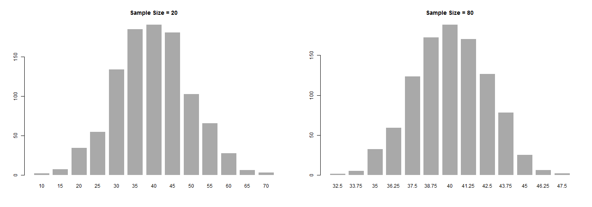

Shiny App
========================================================
Importance of sampling size in statistics

Background
========================================================

The larger the sample size the more accurately the population mean is reflected when doing inference. 

It also improves the significance of the inference.

Example
========================================================
A bag contains 100 colored balls. 
- There are:
  - 40 red
  - 10 blue
  - 50 green

We are going to blindly grab n balls from the bag and estimate the proportion of red balls.

*Proportion of red balls = (number of red balls grabbed)/n.*

What do you think will happen as n (sample size) increases?

Example
========================================================

 

For sample size of 20, the proportion of red balls is more varied.
As the sample size increases to 80, notices how the proportion is now closer to the real value of 40.

Try it out
========================================================
Go to https://carlosjgm.shinyapps.io/explore/ and try it out for yourself!
